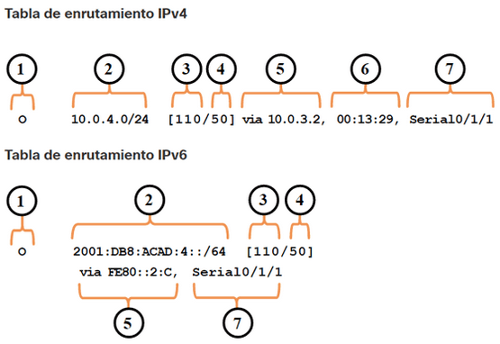
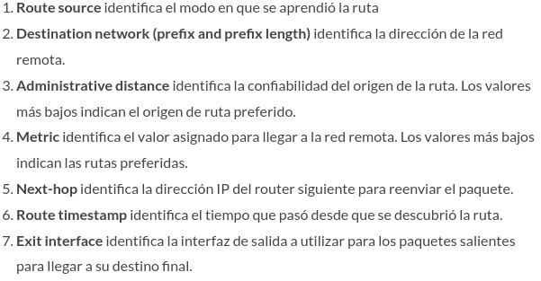

### Modos de comunicacion duplex

- Half-duplex - Se restringen el intercambio de datos a una dirección a la vez.
- Full-duplex - Se permite enviar y recibir simultáneamente.

### SNMP y RADIUS

SNMP (Simple Network Management Protocol) Se trata de un protocolo para la gestión de la transferencia de información en redes,
especialmente para uso en LAN, dependiendo de la versión elegida.

RADIUS (Remote Authentication Dial In User Service) es un protocolo estándar de Internet que proporciona servicios centralizados
de gestión de autenticación, contabilidad e IP para los usuarios de acceso remoto en una red de acceso telefónico distribuida.

# Comandos show

| Command               | Utilidad                                                               |
| --------------------- | ---------------------------------------------------------------------- |
| `show running-config` | Verificar la configuración actual                                      |
| `show interfaces`     | Verificar el estado de la interfaz y ver si hay algún mensaje de error |
| `show ip interface`   | Verificar la información de la capa 3 de una interfaz                  |
| `show arp`            | Verificar la lista de hosts conocidos en las LAN Ethernet locales      |
| `show ip route`       | Verificar la información de enrutamiento de la capa 3                  |
| `show protocols`      | Verificar qué protocolos están operativos                              |
| `show version`        | Verificar la memoria, las interfaces y las licencias del dispositivo   |

### Filtrado de la salida de los comandos show

section
Muestra toda la sección que comienza con la expresión de filtrado.

- Router# `show running-config | section line vty`

include
Incluye todas las líneas de salida que coinciden con la expresión de filtrado.

- Router# `show ip interface brief | include up`

exclude
Excluye todas las líneas de salida que coinciden con la expresión de filtrado.

- Router# `show ip interface brief | exclude unassigned`

begin
Muestra todas las líneas de salida de un determinado punto, empezando por la línea que coincide con la expresión de filtrado.

- Router# `show ip route | begin Gateway`

### Comando debug

Permite mostrar mensajes de depuracion en tiempo real

supervisar el estado de mensajes de ICMP

- Router# `debug ip icmp`

desactivar una característica de depuración específica

- Router# `no debug ip icmp`

Para desactivar todos los comandos debug activos de inmediato

- Router# `undebug all`

### Mostrar mendajes de depuración en una terminal (virtual console)

- R1# `terminal monitor`

detener mensajes de depuración

- R1# `terminal no monitor`

# Configuracion router

### Nombre del dispositivo

- Router(config)# `hostname <hostname>`

### Proteger el modo EXEC (linea de consola)

- Router(config)# `line console 0`
- Router(config-line)# `password <password>`
- Router(config-line)# `login`

### Acceso remoto seguro a Telnet/SSH

- Router(config-line)# `line vty 0 4`
- Router(config-line)# `password <password>`
- Router(config-line)# `login`
- Router(config-line)# `transport input ssh telnet`

### Proteger el modo EXEC con privilegios

- Router(config)# `enable secret <password>`

### Cifrar todas las contraseñas

- Router(config)# `service password-encryption`

### Asignar tamaño minimo a contraseña

- Router(config)# `security passwords min-length 8`

### limitar intentos de inicio de sesión vty durante sierto tiempo

- Router(config)# `login block-for 120 attempts 3 within 60`

### Crear banner

- Router(config)# `banner motd #¡Acceso autorizado únicamente!#`

### Deshabilitar el acceso vía http

- Router(config)# `no ip http server`

### Evitar que los mensajes logging molesten

- Router(config)# `line con 0`
- Router(config-line)# `logging synchronous`
- Router(config)#line aux 0
- Router(config-line)# `logging synchronous`
- Router(config)# `line vty 0 4`
- Router(config-line)# `logging synchronous`

### Comando history

Por defecto, el historial de comandos está activado y el sistema captura las últimas 10 líneas de comandos en su memoria histórica.

- Router# `show history`

Aumentar el número de líneas de comandos que el buffer histórico registra sólo durante la sesión de terminal actual.

- Router# `terminal history size <#>`

### Verificación de configuración de interfaz

Proporciona un resumen de la información clave para todas las interfaces de red de un router/switch.

- Router# `show ip interface brief`

IPv6

- Router# `show ipv6 interface brief`

### Verificar configuracion de la interfaz

- Router# `show running-config <interface>'

### Comando show cdp neighbors

Obtener información de dispositivos vecinos

- Router# `show cdp neighbors`

Revela la dirección IP de un dispositivo vecino

- Router# `show cdp neighbors detail`

Para deshabilitar CDP globalmente

- Router(config)# `no cdp run`

Para deshabilitar CDP en una interfaz

- Router(config)# `int fa0/x`
- Router(config-if)# `no cdp enable`

### Guardar la configuracion

- Router# `copy running-config startup-config`

### Mostrar la tabla ARP

- Router# `show ip arp`

### Mostrar las estadísticas de IPv4 correspondientes a todas las interfaces de un router.

- Router# `show ip interfaces`

### Listar servicios

- Router# `show ip ports all`/`show control-plane host open-ports`

## Entradas en la tabla de enrutamiento

## Enrutamiento estatico

Mostrar el contenido de las rutas estáticas en la tabla de routing.

- Router# `show {ip | ipv6} route static`

- Router(config)# `ip route <network-address> <subnet-mask> { ip-address | exit-intf [ip-address]} [distance]`

IPV6

- Router(config)# `ipv6 route ipv6-prefix/prefix-length {ipv6-address | exit-intf [ipv6-address]} [distance]`

### Ruta estatica de siguiente salto

- Router(config)# `ip route <red-destino> <mask> <ip-sig-salto>`

### Ruta estatica conectada directamente

Las rutas estáticas conectadas directamente solo deben usarse con interfaces seriales punto a punto.

- Router(config)# `ip route <red-destino> <mask> <interfaz-de-salida>`

### Ruta estatica completamente específicada

La diferencia entre una red Ethernet de accesos múltiples y una red serial punto a punto es que esta última solo tiene un dispositivo
más en esa red, el router que se encuentra en el otro extremo del enlace.

Cuando la interfaz de salida sea una red Ethernet, se recomienda utilizar una ruta estática que incluya una dirección del siguiente
salto. También puede usar una ruta estática completamente especificada que incluye la interfaz de salida y la dirección
de siguiente salto.

- Router(config)# `ip route <red-destino> <mask> <interfaz-de-salida> <ip-sig-salto>`

### Ruta Estática por Defecto

- Router(config)# `ip route 0.0.0.0 0.0.0.0 {ip-address | exit-intf}`

Ruta Estática por Defecto IPv6

- Router(config)# `ipv6 route ::/0 {ipv6-address | exit-intf}`

### Rutas Estáticas Flotantes

Las rutas estáticas flotantes son rutas estáticas que se utilizan para proporcionar una ruta de respaldo a una ruta estática
o dinámica principal, en el caso de una falla del enlace. La ruta estática flotante se utiliza únicamente cuando la ruta principal
no está disponible.
Para lograrlo, la ruta estática flotante se configura con una distancia administrativa mayor que la ruta principal. La distancia administrativa representa la confiabilidad de una ruta

- Router(config)# `ip route 0.0.0.0 0.0.0.0 <ip-address> <distance>`
- Router(config)# `ipv6 route ::/0 <ipv6-address> <distance>`

## Enrutamiento dinamico

### RIP

- Routing information protocol
- Distancia administrativa = 120
- Utiliza saltos como metrica
- Solo soporta 15 saltos
- Solo se publican las redes directamente conectadas
- Dos versiones: V1 y V2 (soporta VLSM)

## RIP v1

- Router(config)# `router rip`
- Router(config-router)# `network <network>`

## RIP v2

- Router(config)# `router rip`
- Router(config)# `ver 2`

## EIGRP

Enhanced Interior Gateway Routing Protocol [90/ métrica]

- Router(config)# `router eigrp <1-65535>`
- Router(config-router)# `network <red principal>`

## OSPF

Open Shortest Path First
Costo(metrica) = 10000 0000/ancho de banda en bps
Distancia Administrativa 110

- Router(config)# `router ospf <#>`
- Router(config-router)# `network x.x.x.x <wildcard x.x.x.x> area <#>`

### Configurar subinterfaz (Router-on-a-Stick)

- Router(config)# `int fa0/x`
- Router(config-if)# `no shut`
- Router(config-if)# `int fa0/x.x`
- Router(config-subif)# `encapsulation dot1q <vlan>`
- Router(config-subif)# `ip add <direccion> <mascara>`

### Configurar interfaz serial

- Router(config)# `int sex/x`
- Router(config-if)# `no shut`
- Router(config-if)# `ip address <ip> <mascara>`
- Router(config-if)# `clock rate 64000`

### Configurar interfaz loopback

- Router(config)# `int loopback <num>`
- Router(config-if)# `ip add <direccion> <mascara>`

## Configurar servidor DHCPv4 (Dynamic Host Configuration Protocol v4)

Mostrar una lista de todos los enlaces de direcciones IPv4 a direcciones MAC proporcionados por el servicio DHCPv4.

- Router# `show ip dhcp binding`

Deshabilitar dhcp

- Router(config)# `no service dhcp`

### Excluir direcciones IPv4

- Router(config)# `ip dhcp excluded-address low-address [high-address]`

### Definir un nombre de Pool DHCPv4

- Router(config)# `ip dhcp pool <pool-name>`

### Configuar el Pool DHCPv4

#### Definir el rango de direcciones disponibles

- Router(dhcp-config)# `network network-number [mask | /prefix-length]`

#### Definir la puerta de enlace por defecto del router.

Típicamente, la puerta de enlace es la interfaz LAN del router más cercana a los dispositivos del cliente.
Se requiere una puerta de enlace, pero puedes listar hasta ocho direcciones si hay varias puertas de enlace.

- Router(dhcp-config)# `default-router address [ address2….address8]`

#### Definir un servidor DNS

- Router(dhcp-config)# `dns-server address [ address2…address8]`

#### Definir el nombre de dominio

- Router(dhcp-config)# `domain-name domain`

#### Definir la duración de la concesión DHCP.

- Router(dhcp-config)# `lease {days [hours [ minutes]] | infinite}`

## Configurar router como cliente DHCPv4

configurar una interfaz Ethernet como cliente DHCP

- Router(config-if)# `ip address dhcp`

El método SLAAC permite a los hosts crear su propia dirección unicast global IPv6 sin los servicios de un servidor DHCPv6.

## Comandos de Verificación Servidor DHCPv6

- Router# `show ipv6 dhcp pool`

- Router# show `ipv6 dhcp binding`

## Configurar Relay Agent DHCPv6

- Router(config-if)# `ipv6 dhcp relay destination ipv6-address [interface-type interface-number]`

## Configurar un Servidor DHCPv6 Stateless

Habilitar routing IPv6.

- Router(config)# `ipv6 unicast-routing`

Definir nombre pool DHCPv6.

- Router(config)# `ipv6 dhcp pool IPV6-STATELESS`

Configurar pool DHCPv6.

- Router(config-dhcpv6)# `dns-server 2001:db8:acad:1::254`
- Router(config-dhcpv6)# `domain-name example.com`

Vincular pool DHCPv6 a una interfaz.

- Router(config)# `interface GigabitEthernet0/0/1`
- Router(config-if)# `description Link to LAN`
- Router(config-if)# `ipv6 address fe80::1 link-local`
- Router(config-if)# `ipv6 address 2001:db8:acad:1::1/64`
- Router(config-if)# `ipv6 nd other-config-flag`
- Router(config-if)# `ipv6 dhcp server IPV6-STATELESS`
- Router(config-if)# `no shut`

## Configurar un Cliente DHCPv6 Stateless

Habilitar routing IPv6.

- Router(config)# `ipv6 unicast-routing`

Configurar router cliente para crear LLA.

- Router(config)# `interface g0/0/1`
- Router(config-if)# `ipv6 enable`

Configurar Router cliente para usar SLAAC.

- Router(config-if)# `ipv6 address autoconfig`

## Configurar un Servidor DHCPv6 Stateful

Habilitar routing IPv6.

- Router(config)# `ipv6 unicast-routing`

Definir nombre pool DHCPv6.

- Router(config)# `ipv6 dhcp pool IPV6-STATEFUL`

Configurar pool DHCPv6.

- R1(config-dhcpv6)# `address prefix 2001:db8:acad:1::/64`
- R1(config-dhcpv6)# `dns-server 2001:4860:4860::8888`
- R1(config-dhcpv6)# `domain-name example.com`

Vincular pool DHCPv6 a una interfaz.

- Router(config)# `interface GigabitEthernet0/0/1`
- Router(config-if)# `description Link to LAN`
- Router(config-if)# `ipv6 address fe80::1 link-local`
- Router(config-if)# `ipv6 address 2001:db8:acad:1::1/64`
- Router(config-if)# `ipv6 nd managed-config-flag`
- Router(config-if)# `ipv6 nd prefix default no-autoconfig`
- Router(config-if)# `ipv6 dhcp server IPV6-STATEFUL`

## Configurar un Cliente DHCPv6 Stateful

- Router(config)# `ipv6 unicast-routing`

Configurar router cliente para crear LLA.

- Router(config)# `interface g0/0/1`
- Router(config-if)# `ipv6 enable`

Configurar Router cliente para usar SLAAC.

- Router(config-if)# `ipv6 address dhcp`

---

# Configuracion switch

Para el acceso a la administración remota de un switch, este se debe configurar
con una dirección IP y una máscara de subred. Recuerde que para administrar un switch
desde una red remota, se lo debe configurar con un gateway predeterminado.

De manera predeterminada, el switch está configurado para que el control de la administración del
switch se realice mediante la VLAN 1.

- SVI: interfaz virtual del switch. La SVI es una interfaz virtual, no un puerto físico del switch.

Por motivos de seguridad, se considera una buena práctica utilizar una VLAN distinta de la VLAN 1 para configurar SVI

### Configurar consola

- switch(config)# `line con 0`

prevenir que los mensajes de consola interrumpan los comandos

-switch(config-line)# `logging synchronous`

### Configuracion de la interfaz de administracion de un switch

- switch(config)# `interface vlan 99`
- switch(config-if)# `ip address <ip> <mask>`
- switch(config-if)# `no shutdown`

### Configuracion del gateway predeterminado de un switch

- switch(config)# `ip default-gateway <ip>`

### Verificar la configuracion de la interfaz de administracion de un switch

- switch# `show ip interface brief`

### Configurar ssh

1. Verificar el soport de ssh

- Switch# `show ip ssh`

2. Configurar el nombre de dominio IP de la red

- Switch(config)# `ip domain-name <domain-name>`

3. Generar pares de claves RSA.

Configurar ssh version 2

- Switch(config)# `ip ssh version 2`

habilitar el servidor de SSH en el switch y generar un par de claves RSA

- Switch(config)# `crypto key generate rsa`

eliminar el par de claves RSA

- Switch(config)# `crypto key zeroize rsa`

Configurar la autenticación de usuario.

- Switch(config)# `username <username> secret <password>`

Configurar las líneas vty.
Habilitar el protocolo SSH en las líneas vty

- Switch(config)# `line vty 0 #`
- Switch(config-line)# `transport input ssh`

Requerir la autenticación local para las conexiones SSH de la base de datos local de nombres de usuario

- Switch(config-line)# `login local`

### Port Security

1. inhabilitar puertos no utilizados mediante el comando `shutdown` a cada interfaz o a un rango de interfaces.
2. Mitigar desbordamiento en la tabla de dirrecciones MAC mediante Port Security(solo se puede configurar en puertos de acceso o trunks configurados manualmente)

   - Switch(config-if)# `switchport mode access`
   - Switch(config-if)# `switchport port-security`

   Mostrar la configuración de port security

   - Switch# `show port-security interface <interface>`
   - Switch# `show port-security address`

   Asignar un máximo de direcciones MAC permitidas en un puerto

   - Switch(config-if)# `switchport port-security maximum <value>`

   Configurar como el switch aprendera las direcciones MAC en un puerto seguro

   Manually Configured | Configuración manual

   - Switch(config-if)# `switchport port-security mac-address <mac-address>`

   Dynamically Learned | Aprendisaje Dinamico

   Cuando se ingresa el comando switchport port-security, la MAC origen actual para el dispositivo
   conectado al puerto se asegura automáticamente pero no se agrega a la configuración de inicio/startup

   Dynamically Learned – Sticky | Aprendisaje dinamico - adherente

   Habilitar el switch para que aprenda dinámicamente la dirección MAC y la «pegue/stick» a la configuración en ejecución/running

   - Switch(config-if)# `switchport port-security mac-address sticky`

#### Port Security Aging

    Habilitar/deshabilitar el envejecimiento estático para el puerto seguro,
    o para establecer el tiempo o el tipo de vencimiento.

    - Switch(config-if)# `switchport port-security aging { static | time time | type {absolute | inactivity}}`

#### Pasos para mitigar ataques Salto de VLAN (VLAN Hopping)

1. Deshabilitar las negociaciones de DTP en puertos que no sean troncales mediante el comando de configuración de la interfaz
   `switchport mode access`

2. Deshabilitar los puertos no utilizados y colócarlos en una VLAN no utilizada.

3. Activar manualmente el enlace troncal en un puerto trunking utilizando el comando `switchport mode trunk`

4. Deshabilitar las negociaciones de DTP en los puertos troncales mediante el comando `switchport nonegotiate`

5. Establecer la VLAN nativa en otra VLAN que no sea la VLAN 1 mediante el comando `switchport trunk native vlan <vlan_number>`

### Port Security: Modos de Violación de Seguridad

    Si la dirección MAC de un dispositivo conectado al puerto difiere de la lista de direcciones seguras,
    entonces ocurre una violación de puerto. El puerto entra en el estado de error-disabled de manera predeterminada.

    - Switch(config-if)# `switchport port-security violation { protect | restrict | shutdown}`

    Puertos en Estado error-disabled

    Para volver a habilitar el puerto, primero use el comando `shutdown`, luego usa el comando `no shutdown`
    para que el puerto sea operativo.

### Imprementar DHCP Snooping

Verificar el DHCP snooping

- Switch# `show ip dhcp snooping`

Ver los clientes que han recibido información del DHCP

- Switch# `show ip dhcp snooping binding`

- Switch(config)# `ip dhcp snooping`

En puertos de confianza, usa el comando de configuración de interfaz

- Switch(conf-if)# `ip dhcp snooping trust`

Limitar la cantidad de mensajes de descubrimiento/Discovery de DHCP que puede recibir por segundo en puertos no confiables

- Switch(conf-if)# `ip dhcp snooping limit <rate>`

Habilita DHCP snooping por VLAN, o por un rango de VLAN

- Switch(config)# `ip dhcp snooping vlan`

### Configurar DAI (Dynamic ARP Inspection)

Asignar DAI a puertos de confianza

- Switch(conf-if)# `ip arp inspection trust`

Asignar DAI a vlan's

- Switch(config)# `ip arp inspection vlan <vlan>`

Se utiliza para configurar DAI para descartar paquetes ARP cuando las direcciones IP no son válidas.
Se puede usar cuando las direcciones MAC en el cuerpo de los paquetes ARP no coinciden con las direcciones
que se especifican en el encabezado Ethernet

- Switch(config)# `ip arp inspection validate {[src-mac] [dst-mac] [ip]}`

### Configurar PortFast

PortFast omite los estados de escucha/listening y aprendizaje/learning de STP para minimizar el tiempo que los puertos
de acceso deben esperar a que STP converja.
Si habilitas PortFast en un puerto que se conecta a otro switch, corres el riesgo de crear un bucle de árbol de expansión.

Configurar PortFast en interfaz

- Switch(conf-if)# `spanning-tree portfast`

Configurar PortFast en todos los puertos de acceso

- Switch(config)# `spanning-tree portfast default`

### configurar BPDU Guard

Aunque PortFast está habilitado, la interfaz seguirá escuchando por BPDUs

Si se recibe una BPDU en un puerto de acceso habilitado para BPDU Guard, el puerto se coloca en estado error-disabled.
Esto significa que el puerto se cierra y debe volver a habilitarse manualmente o recuperarse automáticamente mediante
el comando global:

- Switch(config)# `errdisable recovery cause psecure_violation`

Habilitar BPDU Guard en una interfaz

- Switch(conf-if)# `spanning-tree bpduguard enable`

Habilitar BPDU Guard en puertos habilitados para PortFast

- Switch(config)# `spanning-tree portfast bpduguard default`

### STP (Spanning Tree Protocol)

STP evita que ocurran bucles mediante la configuración de una ruta sin bucles a través de la red,
con puertos “en estado de bloqueo” ubicados estratégicamente.

Mostrar información sobre el estado del árbol de expansión

- Switch# `show spanning-tree summary`

### Verificar la Configuración de Enlaces Troncales

- Switch# `show interfaces fax/x switchport`

### Configurar puerto como enlace troncal

- Switch(config)# `int fax/x`
- Switch(conf-if)# `switchport trunk encapsulation dot1q`
- Switch(conf-if)# `switchport mode trunk`
- Switch(config-if)# `switchport trunk native vlan 99`
- Switch(config-if)# `switchport trunk allowed vlan 10,20,30,99`

### Restablecer Enlace Troncal al Estado Predeterminado

- Switch(config-if)# `no switchport trunk allowed vlan`
- Switch(config-if)# `no switchport trunk native vlan`

Protocolo de Enlace Troncal Dinámico (DTP, Dynamic Trunking Protocol).

### Para habilitar los enlaces troncales desde un switch de Cisco hacia un dispositivo que no admite DTP:

- Switch(config-if)# `switchport mode trunk`
- Switch(config-if)# `switchport nonegotiate`

### Habilitar dtp

- Switch(config-if)# `switchport mode dynamic auto`

### Mostrar default SDM template

- switch# `show sdm prefer`

Asignar dual-ipv4-and-ipv6 template por defecto

- switch(config)# `sdm prefer dual-ipv4-and-ipv6 default`
- switch# `reload`

### Configurar velocidad de puertos y modo duplex

- Switch(config-if)# `duplex <full|half|auto>`
- Switch(config-if)# `speed <speed|auto>`

### Funcion Auto-MDIX

Cuando se utiliza auto-MDIX en una interfaz, la velocidad de la interfaz y el dúplex
deben ajustarse a auto para que la función funcione correctamente.

- Switch(config-if)# `mdix auto`

Examinar la configuración de auto-MDIX para una interfaz específica

- Switch# `show controllers ethernet-controller fa0/1 phy | include MDIX`

### Mostrar la tabla de direcciónes MAC

- Switch# `show mac-address-table`

# Vlan's

Las VLAN son grupos lógicos numerados a los que se pueden asignar puertos físicos.
Los parámetros de configuración aplicados a una VLAN también se aplican a todos los
puertos asignados a esa VLAN.

### Crear vlan

para crear varias vlan's
vlan 100,102,105-107

- Switch(config)# `vlan <vlan-id>`
- Switch(config-vlan)# `name <vlan-name>`

### Configurar interfaces vlan SVI (multilayer switch)

- Switch(config)# `interface vlan <vlan-id>`
- Switch(config-if)# `description <description>`
- Switch(config-if)# `ip add <ip> <mask>`
- Switch(config-if)# `no shut`

### Asignar puertos de acceso (multilayer switch)

- Switch(config)# `interface <int>x/x`
- Switch(config-if)# `description <description>`
- Switch(config-if)# `switchport mode access`
- Switch(config-if)# `switchport access vlan <vlan-id>`

### Habilitar enrutamiento ipv4 (multilayer switch)

- Switch(config)# `ip routing`

### Configurar puerto enrutado (multilayer switch)

- Switch(config-if)# `no switchport`

### Asignar puertos a vlan

- Switch# `configure terminal`
- Switch(config)# `interface <id-interface>`
  > Asignar un rango de puertos:
- Switch(config)# `interface range <puertos>`
- Switch(config-if-range)# `switchport mode access`
- Switch(config-if-range)# `switchport access vlan <id-vlan>`
- Switch(config-if-range)# `end`

Para volver a cambiar la pertenencia de un puerto a la VLAN 1 predeterminada:

- Switch(config-if)# `no switchport access vlan`

### Asignar puerto a vlan de voz

- Switch(config-if)# `switchport mode access`
- Switch(config-if)# `switchport access vlan 20`
- Switch(config-if)# `mls qos trust cos`
- Switch(config-if)# `switchport voice vlan 150`

### Listar informacin de VLAN

- Switch# `show vlan brief`

## Etherchannel

### Etherchannel (manual)

- Switch(config-if-range)# `shutdown`
- Switch(config-if-range)# `channel-group 1 mode desirable`
- Switch(config-if-range)# `no shutdown`
- Switch(config-if-range)# `exit`
- Switch(config)# `interface port-channel #`
- Switch(config)# `switchport mode trunk`

### Etherchannel (LACP)

- Switch(config-if-range)# `channel-group <number> mode active`
- Switch(config-if-range)# `exit`
- Switch(config-if)# `interface port-channel <number>`
- Switch(config-if)# `switchport mode trunk`
- Switch(config-if)# `switchport trunk allowed vlan 1,2,20`

### Verificar una configuración EtherChannel

- Switch# `show interfaces port-channel 1`
- Switch# `show etherchannel summary`
- Switch# `show etherchannel port-channel`
- Switch# `show interfaces f0/1 etherchannel`
